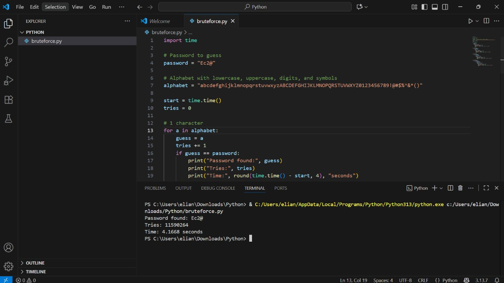

# Basic Brute Force Example

This repository contains a simple Python script that demonstrates how brute force attacks work by trying every possible combination of characters until it matches the target password. The project shows how fast weak passwords can be cracked and why secure credentials are necessary.

---

## 🔧 How to execute

1. Clone this repository or download it as a ZIP:
   ```bash
   git clone https://github.com/WilianColdAP38/bruteforce-password.git
   cd bruteforce-password


# Sample run

With the test password "Ec2@", the terminal showed the following output:
```bash
Password found: Ec2@
Tries: 11590264
Time: 4.1668 seconds
```


# Observations

## I realized that passwords made of only a few letters are guessed really fast.  
## When I switched to longer ones that mix symbols, numbers, and uppercase letters, the search time grew a lot.  
## This showed me that every extra detail in a password makes it much harder to break.  

# Reflection

## If a password has 8 or more characters and also includes uppercase letters, numbers, and special symbols, the number of possible combinations becomes enormous.  
## In practice, this means a simple brute force script like the one in this project would take an extremely long time, in some cases years, to find the correct password.  
## That’s why long and complex passwords are considered safe against brute force attacks, and why websites always require this kind of rules when creating accounts.  


# Files

bruteforce.py: Python script with the brute force algorithm.

README.md: Instructions, usage example, and reflections.

# Screenshot



